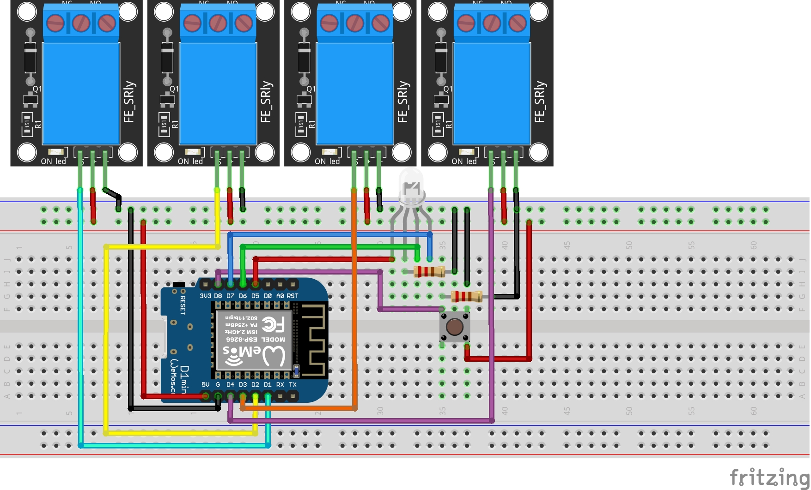
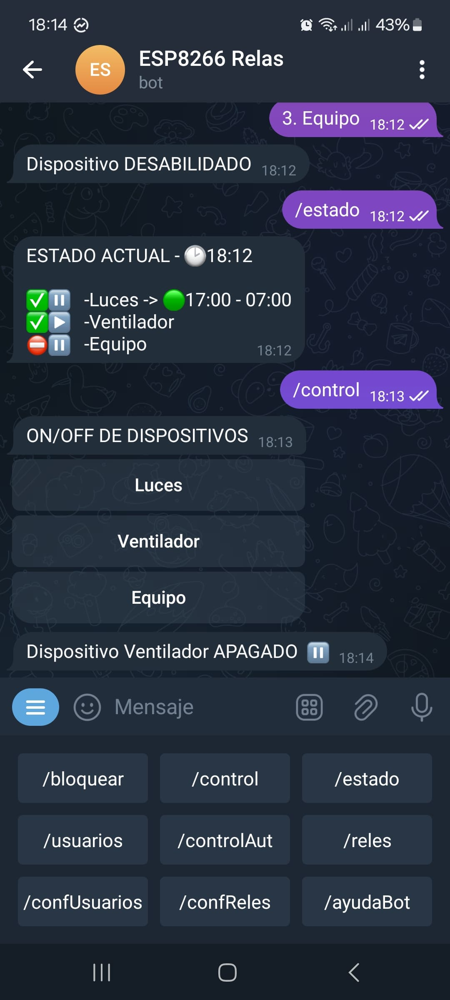
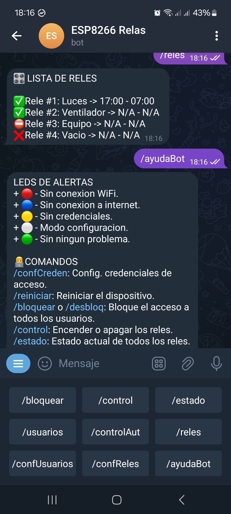

# Control de Reles con Telegram Bot

Este proyecto permite controlar **relés** de manera remota a través de un **bot de Telegram**. Utiliza un **ESP8266**, que recibe comandos para encender o apagar relés, gestionar usuarios y configurar horarios de encendido y apagado automáticos. Además.

---

## 🖼️ Diagrama

  

---

## 📡 Funcionamiento

1. **ESP8266** se conecta a Internet y se vincula con un bot de Telegram.
2. **Recibe comandos desde Telegram** para encender/apagar relés y configurar el sistema.
3. **Soporta control manual y automático** según reglas predefinidas.
4. **Incorpora un sistema de alertas LED** para indicar el estado de la conexión y configuración.
5. **Permite la gestión de usuarios y relés registrados.**

---

## 🚦 LEDs de Alertas

- 🔴 **(Rojo)** - Sin conexión WiFi.
- 🔵 **(Azul)** - Sin conexión a Internet.
- 🟡 **(Amarillo)** - Sin datos configurados.
- ⚪ **(Blanco)** - Modo configuración activado.
- 🟢 **(Verde)** - Todo funcionando correctamente.

---

## 📜 Comandos del Bot de Telegram

### 🔹 **Comandos Generales**

| **Comando**             | **Función**                                                                                                                                   |
| ----------------------- | --------------------------------------------------------------------------------------------------------------------------------------------- |
| `/confCreden`           | Configurar credenciales de acceso mediante WifiManager.                                                                                       |
| `/bloquear`, `/desbloq` | Bloquea o habilita el acceso a todos los usuarios. `(el primer usuario es el admin. y su funcion es normal en estado bloqueado (/bloquear)).` |
| `/control`              | Encender o apagar los relés manualmente.                                                                                                      |
| `/estado`               | Muestra el estado actual de todos los relés.                                                                                                  |
| `/usuarios`             | Lista de usuarios registrados.                                                                                                                |
| `/reles`                | Lista de relés registrados.                                                                                                                   |
| `/controlAut`           | Configurar encendido/apagado automático de los reles.                                                                                         |
| `/confUsuarios`         | Gestionar a los usuarios permitidos.                                                                                                          |
| `/confReles`            | Gestionar los relés registrados.                                                                                                              |

### 🔸 **Comandos para Pruebas**

| **Comando**   | **Función**                                            |
| ------------- | ------------------------------------------------------ |
| `/resetDatos` | Limpia todos los datos guardados (no WiFi).            |
| `/testReles`  | Prueba el funcionamiento de los relés.                 |
| `/pruebaLed`  | Prueba el funcionamiento de los LEDs de advertencia.   |
| `/debug`      | Muestra los datos en el puerto serial para depuración. |

---

## 🖼️ Capturas

  
  

---

## ⚙️ Flujo de Operaciones

1. **Inicio y Configuración**: Al encender el dispositivo, se intenta conectar a WiFi y recuperar configuraciones almacenadas. Si no hay datos, entra en **modo configuración**.
2. **Interacción con el Bot de Telegram**: Los usuarios pueden enviar comandos para controlar los relés y configurar permisos.
3. **Alertas LED**: Indican el estado del sistema en tiempo real.
4. **Notificaciones**: Se envían mensajes en Telegram cuando hay cambios importantes o errores.

---

## 🛠️ Consideraciones

- Se requiere una **conexión estable a Internet** para la correcta interacción con Telegram.
- Si el dispositivo pierde conexión, intentará **reconectarse automáticamente**.
- El **modo de configuración** permite ingresar credenciales de acceso mediante el AP de **WifiManager**.

---

## 📌 Configuración del Entorno

- **Placa**: LOLIN(WEMOS) D1 mini
- **IDE**: Arduino IDE `v2.3.x`
- **Framework**: Arduino ESP8266 `v3.1.2`
- **Flash Size**: `4MB(FS: 3MB OTA: 512MB)`
- **Librerías necesarias**:
  - `WiFiManager` `v2.0.17` → Para la configuración de la conexión WiFi.
  - `UniversalTelegramBot` `v1.3.0` → Para la comunicación con Telegram.
  - `ArduinoJson` `v6.21.5` → Para el manejo de datos en JSON.

---

## 📡 Componentes

- 1x **Placa ESP8266**
- 1x **Módulo de Relés** (dependiendo del número de dispositivos a controlar)
- 1x **Led RGB**
